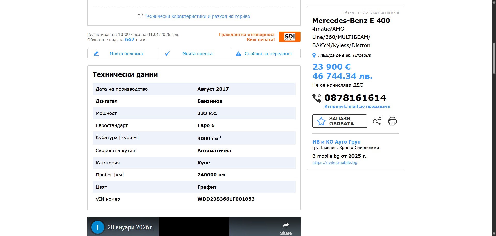
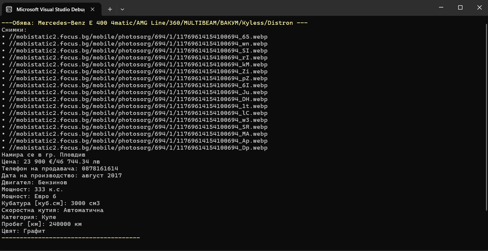

# MobileBgScraper

Конзолно приложение за извличане на информация от обяви в mobile.bg.

## Функционалности

- Извличане на заглавие на обявата
- Извличане на всички снимки
- Извличане на локация
- Извличане на цена
- Извличане на технически характеристики (двигател, скоростна кутия, пробег, цвят и др.)
- Обработка на липсващи обяви (404)

## Технологии

- .NET
- AngleSharp (HTML parsing)

## Примери

### Обява в mobile.bg




### Резултат в конзолата



## Използване

```bash
dotnet run
```
